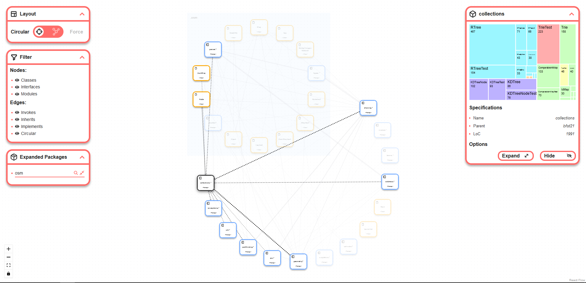
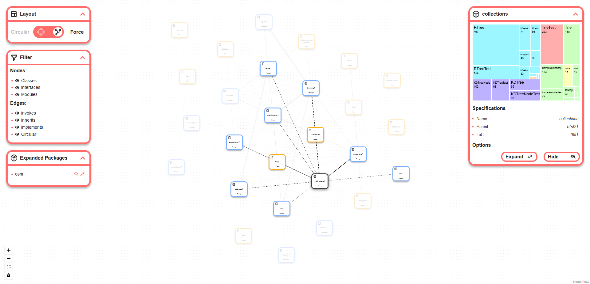

# Untangle
Untangle is a architecture recovery & visualization tool for analyzing Java codebases, their software entities, and their internal dependencies.
Untangle features no ads, tracking, cloud, server, source code pollution, and is completely open-source.

<h3> Untangle is part of a research study - please fill out our <a href="https://docs.google.com/forms/d/e/1FAIpQLSdklKw3WTpTMkxsHGbBROVpRa4UMqqKAwNolv2vco42i0Tv8Q/viewform">short survey</a> after trying out the tool. Thank you! </h3>

## Untangle Capabilities
* View your project in either the **Circular** or **Force-directed** layouts.
* **Expand** and **collapse** packages to gain better insight into your project's hierachial structure.
* **Highlight** edges pertaining to a specific class / interface / package in your system by selecting nodes, and gain insights into metrics of the chosen entity.
* Control your view with **filtering** and **hiding** of unneeded elements.  


| View | Image |
| --- | --- |
| Circular Layout |  | 
| Force-directed Layout |  |


# Running Untangle
Untangle can be executed in **2** different ways - in an isolated [docker container](#running-untangle-in-docker-recommended) *(recommended)*, or [locally in your own environment](#running-untangle-locally). After having ran the application once, you can refer to [rerunning Untangle](#rerunning-the-app) for easier execution.

## Running Untangle in Docker *(recommended)*

### Prerequisites.
* A buildable maven or gradle Java project.
* Your project must be buildable with Java 8, 11, 12, 13, 14, 15, 16, or 17.
* [Docker](https://docs.docker.com/get-docker/) installed.
* A bit of patience, executing the analysis can take up to 10 minutes depending on your specifications.


### Step-by-step guide

First you must open a terminal as administrator and go to the project you wish to analyze with the command
```
cd ${project-to-analyze}
```
where `${project-to-analyze}` is replaced with the path to your Java project e.g `~/Desktop/MyJavaProject`  
then find your operating system underneath and follow the instructions.

---

<details>
<summary>

### UNIX users (Mac & Linux)

</summary>

UNIX users can use the following command to run Untangle through docker.
```
curl https://raw.githubusercontent.com/Markusgp/Untangle/main/untangle.sh | bash -s -- ${java-version}
```
where `${java-version}` should be replaced by the Java version that your project is buildable with.

For example, if you wanna run the application with Java 15 the command would be:
```
curl https://raw.githubusercontent.com/Markusgp/Untangle/main/untangle.sh | bash -s -- 15
```
After the application is up and running, you can open it by navigating to url `localhost:8080` in a browser.

</details>


<details>
<summary>

### Windows users

</summary>

Windows users have to use **powershell with administration rights** and first enable powershell to run scripts in your current session with the following command:
```
PowerShell -ExecutionPolicy Bypass
```
Next you have to set the environment variable `UNTANGLE_JAVA` to a Java version that your project is buildable with, which can be done using the following command
```
$Env:UNTANGLE_JAVA = '${java-version}'
```
Now you can run the run script with the following command
```
(New-Object System.Net.WebClient).DownloadString("https://raw.githubusercontent.com/Markusgp/Untangle/main/untangle.ps1") | powershell
```

An example of running the app through docker with Java version 15 this is the following commands that will be ran
```
PowerShell -ExecutionPolicy Bypass

$Env:UNTANGLE_JAVA = '15'

(New-Object System.Net.WebClient).DownloadString("https://raw.githubusercontent.com/Markusgp/Untangle/main/untangle.ps1") | powershell
```

After the application is up and running, you can open it by navigating to url `localhost:8080` in a browser.

</details>

---

<details>
<summary>

## Running Untangle locally

</summary>

If you are running the app locally these are the files/directories that will go in your source project
- qlpack.yml (codeql dependencies)
- codeql (codeql queries)
- codeql-database-java (the codeql database)


### Prerequisites.
* A buildable maven or gradle Java project.
* Version (16.0+) of [npm](https://docs.npmjs.com/downloading-and-installing-node-js-and-npm) installed.
* [CodeQL CLI](https://codeql.github.com/docs/codeql-cli/getting-started-with-the-codeql-cli/) installed.
* Your Java project must be buildable on your local machine.
* Git to clone the project

### Step-by-step guide
First you have to clone the project

Then to run the app locally you can execute the ``run.sh`` script with some parameters:

```
./run.sh ${language} ${path-to-project}
```

1. `${language}` must be specified to `java`, as it is, for now, the only supported language.
2. `${path-to-project}` must be set to the path to the project that you want to analyze with Untangle.

</details>

---

<details>
<summary>

## Rerunning Untangle

</summary>

If you have already done an analysis on the project, and you wish to see the same data, you do not need to run the whole analysis again.

If you ran the application locally, you can simply use the `npm start` command and the application with the previous data should be displayed.

If you ran the application in docker, you need to run `docker exec untangled /bin/bash -c "cd react-app; npm start"`

</details>

---

## Contact
If there is any problems with the tool or you have any questions regarding the tool feel free to reach us on any of these emails
- guch@itu.dk
- kabm@itu.dk
- mgrp@itu.dk
- dlli@itu.dk
